# Gestor de Dados

Aqui será documentado a segunda parte do projeto integrador do curso de ADS em Senac - São Paulo, trata-se de um gestor de dados de um centro universitário.

Teremos o que chamamos de CRUD (_**C**reate **R**ead **U**pdate **D**elete_) de alguns módulos já pré modelados na parte anterior que são:

- Pessoa Físicas
- Pessoa Jurídicas
- Professores
- Fornecedores
- Alunos

Teremos alguns artefatos desenvolvidos, alguns mini-tutorias para execução do projeto, protótipos de interfaces e muito mais.
## Sumário

- [Modelagem](#modelagem)
- [Interfaces](protótipo-de-interfaces)
- [Time](#time)
## Modelagem

A parte um deste projeto teve como objetivo a modelagem a abstração da ideia por meio de alguns diagramas. 

Artefatos estes que estão dísponíveis aqui:

- Documento (PDF) - [Google Drive](https://drive.google.com/file/d/1I7Y5vxHYHhnPMLAOZl93TunKZAz_cZ2-/view?usp=sharing)
- Documento - [Google Docs](https://docs.google.com/document/d/1TqrN_IuCeWMEyXb-CXqCkhHOr9Q_l1iyzX398EwOKeo/edit)
- Histórias de Usuário - [Miro](https://miro.com/app/board/uXjVMnEIVQA=/?share_link_id=393423487458)
- Protótipo de Interfaces - [Figma](https://www.figma.com/file/tQYedRUUAFLAFfGWXo2UXi/Gestor-de-dados---Projeto-Integrador(Senac)?type=design&node-id=0%3A1&mode=design&t=osd43U6dPki2uNTc-1)
## Protótipo de Interfaces

Aqui será uma seção que demonstrará os fluxos visuais de cada entidade:

### Página Inicial

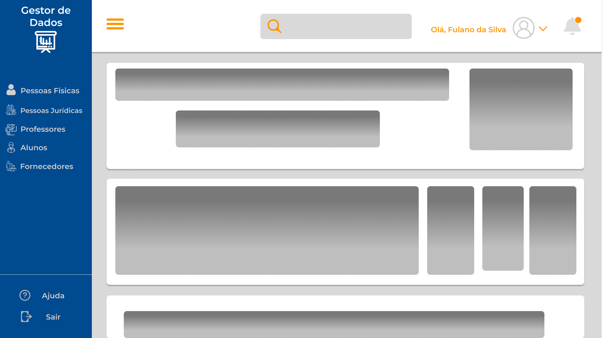

### Pessoa Física

Página Inicial:

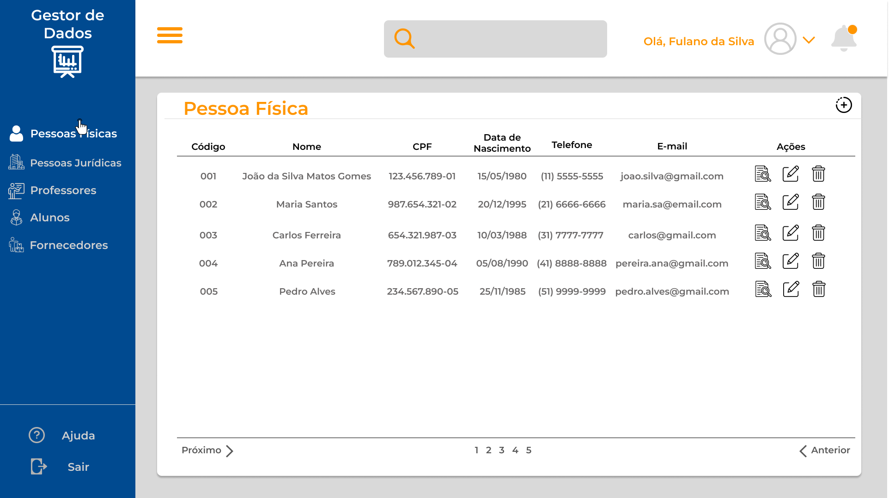

Cadastro:

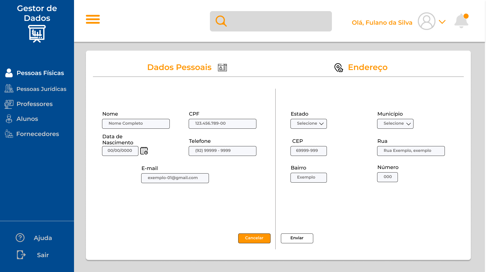

Edição:

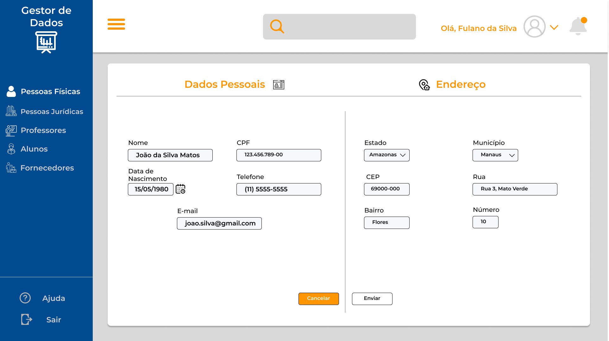

Exclusão:

### Pessoa Jurídica

Página Inicial:

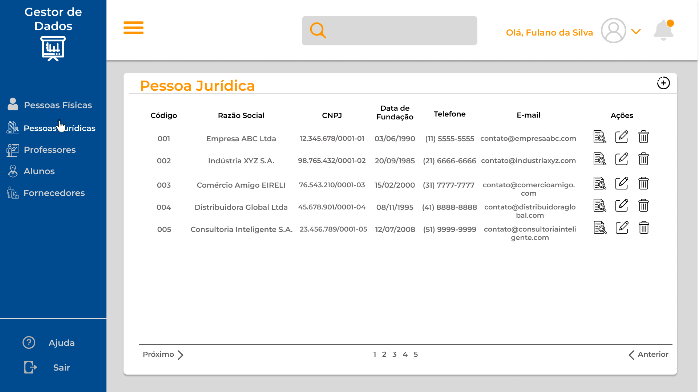

Cadastro:

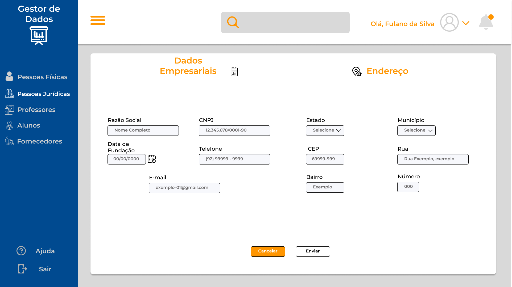

Edição:

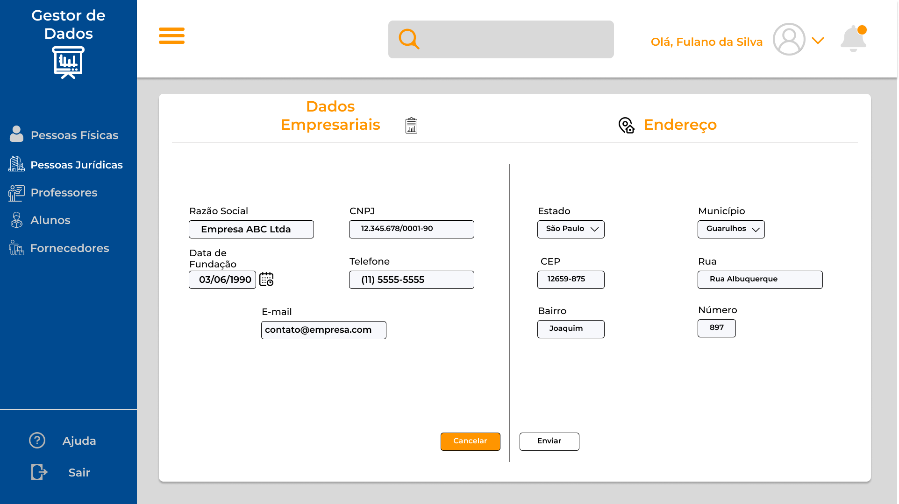

Exclusão:

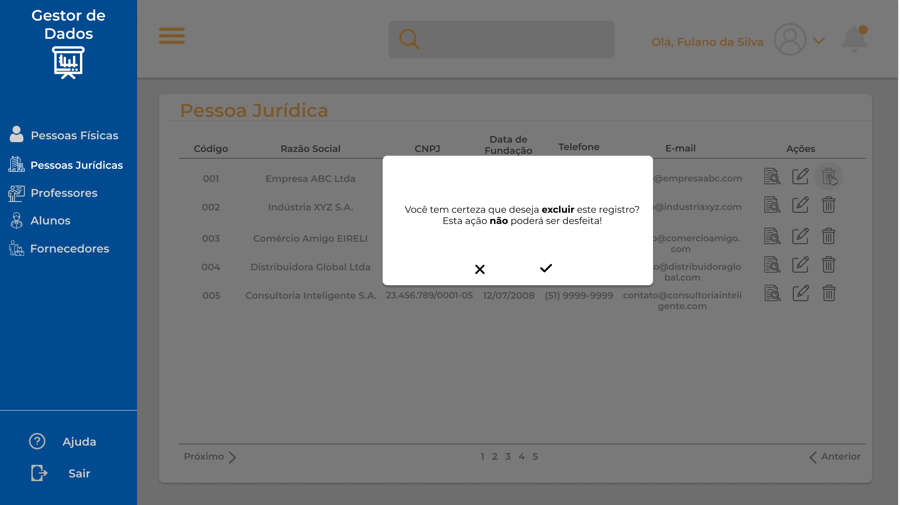

### Professor

Página Inicial:

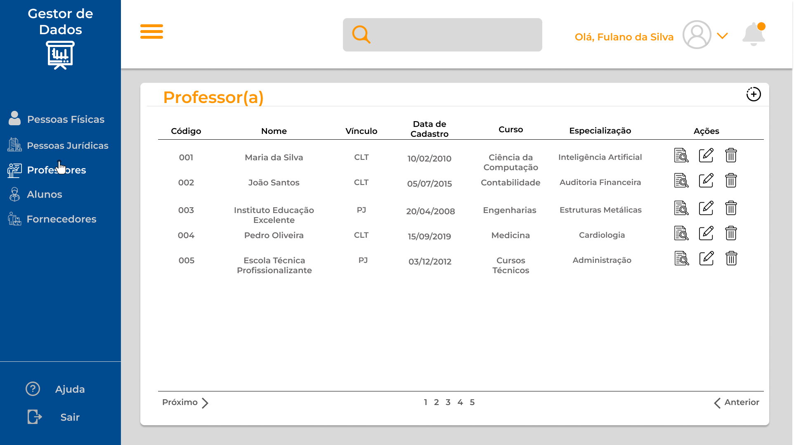

Cadastro:

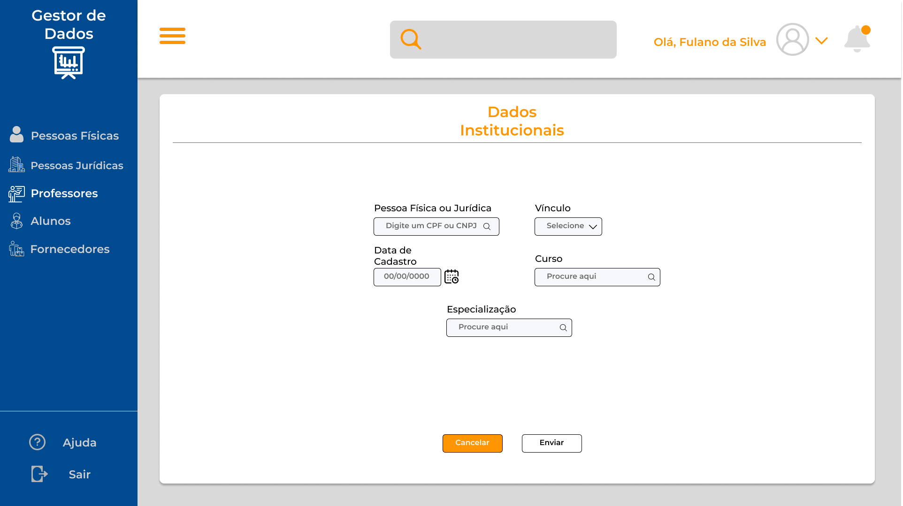

Edição:

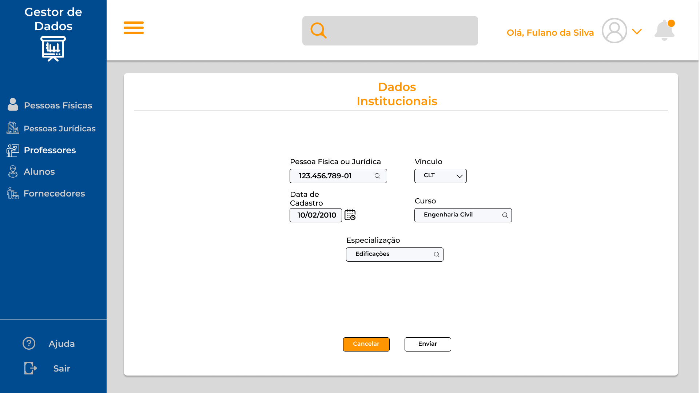

Exclusão:

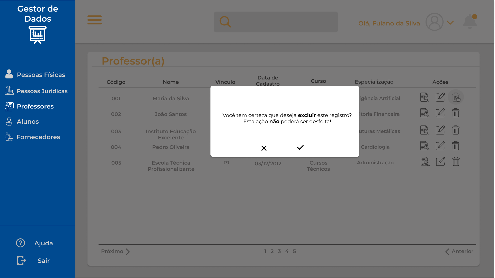

### Aluno

Página Inicial:

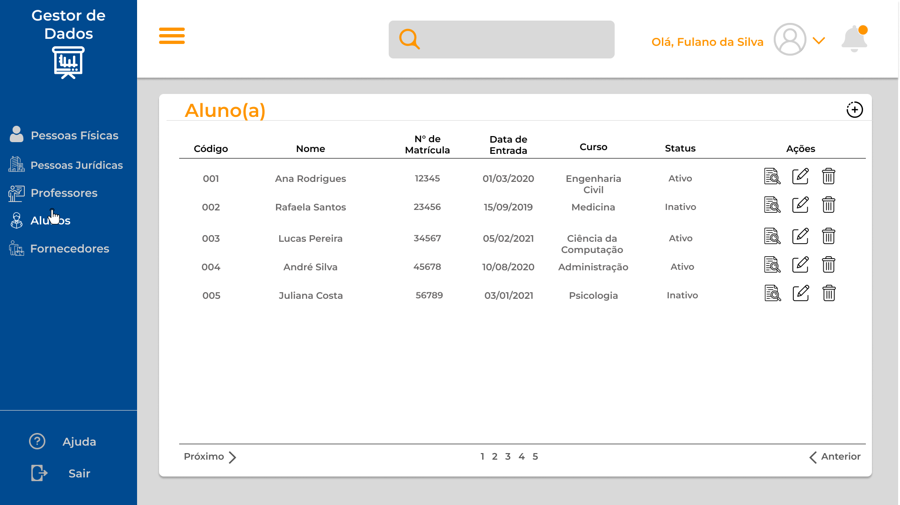

Cadastro:

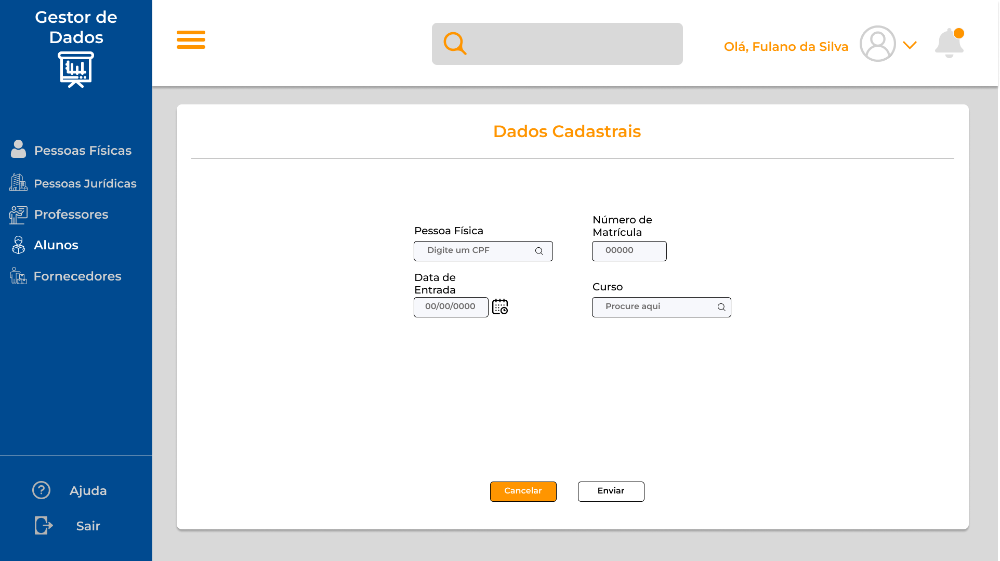

Edição:

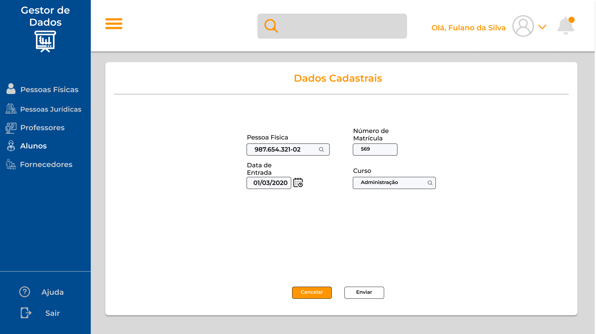

Exclusão:

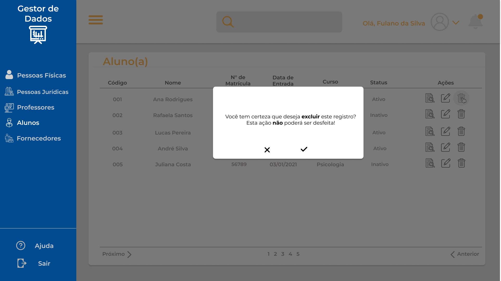

### Fornecedor

Página Inicial:

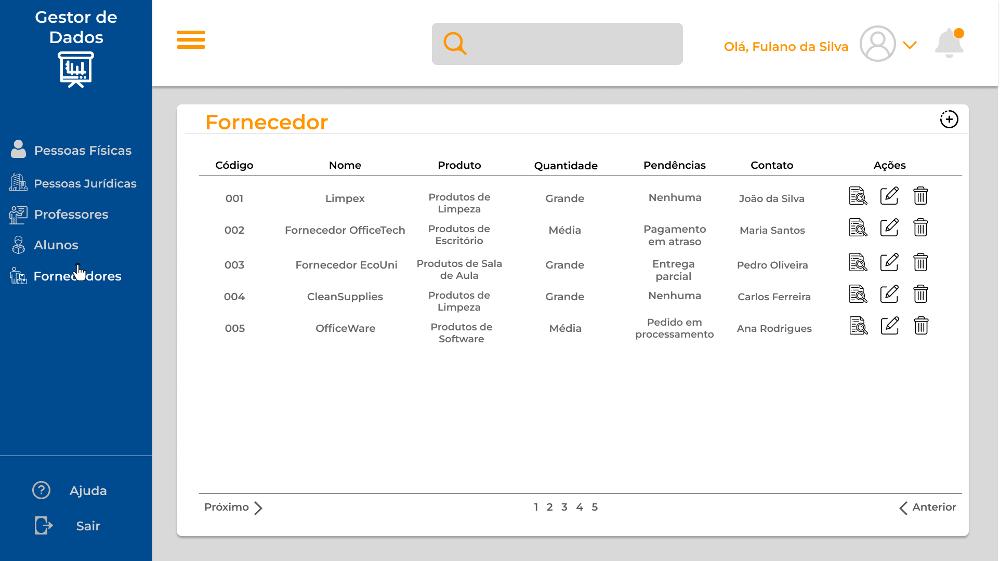

Cadastro:

Edição:

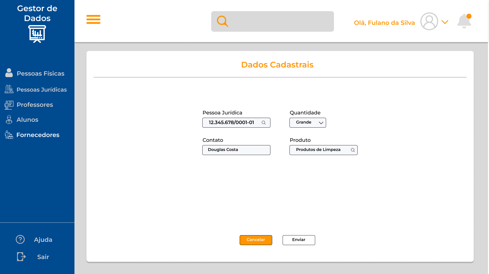

Exclusão:

## Time

O time deste projeto é composto por:

- Isaías Leite
- Alice Maria
- Guilherme Moreira
- Wanderson Moutinho
- Raphael Pavanelli
- Helbio Renato
